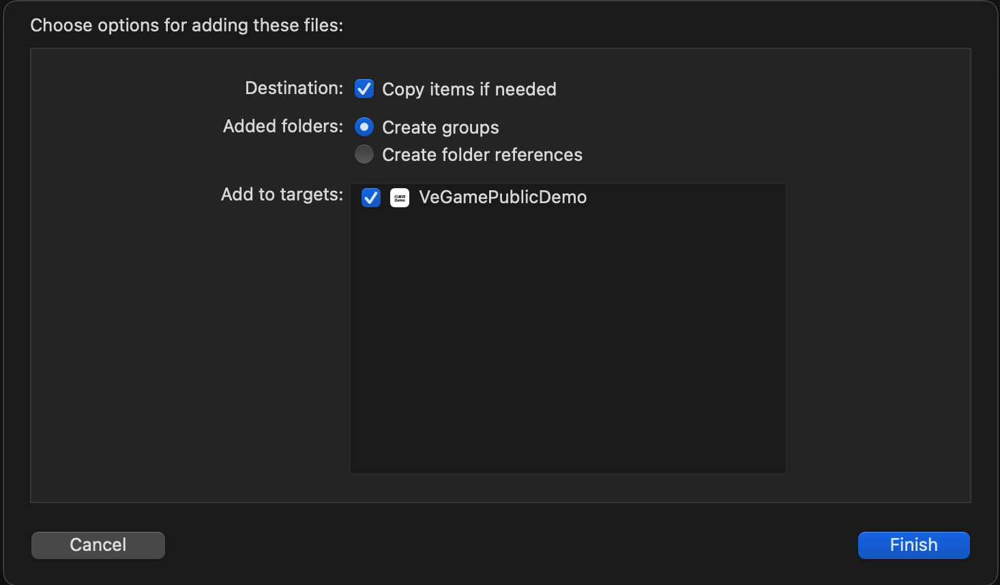
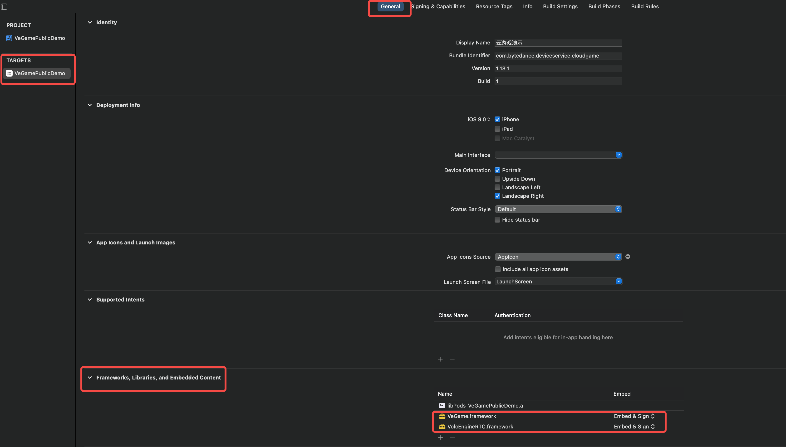
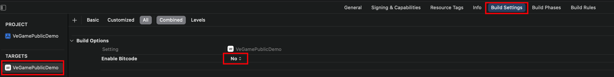
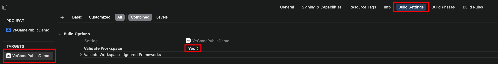

# 火山引擎云游戏 iOS 客户端 SDK 接入说明  

本文档描述了火山引擎云游戏 iOS 客户端 SDK 的使用说明，方便开发者快速接入。

## 集成准备

### SDK 下载

|  **SDK 包文件**  |  **快速接入 Demo（GitHub 仓库）**  |
| --- | --- |
| [前往云游戏控制台](https://console.volcengine.com/veGame/guidepage?activeStep=sdk) | [Quick Start Demo](https://github.com/volcengine/veGame/tree/master/QuickStart/iOS) |

### 环境要求

* iOS 9.0 及以上系统版本的设备
* 使用 Objective-C 开发语言

说明：本文档中涉及编译器的示例图参考 Xcode 12.4 版本。

### 工程配置

1. 下载 veGameSDK 压缩包后，解压得到 `VeGame.framework` 和 `VolcEngineRTC.framework` 文件夹。手动将 `VeGame.framework` 和 `VolcEngineRTC.framework` 拖入目标工程，选择如下：



2. 添加 `VeGame.framework` 和 `VolcEngineRTC.framework`：



3. 修改 Build Settings  设置：

第一步：



第二步：



4. 权限声明，在 `info.plist` 文件中配置“相机、麦克风、定位”相关使用权限说明：

|  **字段**  |  **描述**  |
| --- | --- |
| Privacy -  Camera Usage Description | 允许访问使用“相机”功能权限 |
| Privacy - Microphone Usage Description | 允许访问使用“麦克风”功能权限 |
| Privacy - Location When In Use Usage Description | 允许访问使用“定位”功能权限 |

## 快速接入

### 初始化 VeGameManager 配置

参考以下代码，初始化并启动云游戏：

参考示例：

```objectivec
- (BOOL)application:(UIApplication *)application didFinishLaunchingWithOptions:(NSDictionary *)launchOptions
{
    // 设置配置信息，建议在程序一启动的时候就调用
    [VeGameManager setupConfigWithAccountId: AccountId];
}
```

### 创建 VeGameManager 实例

描述：初始化云游戏实例、设置画布、配置 VeGameConfigObject 配置参数，然后调用 startWithConfig: configObj 接口，申请云游戏服务。

参考示例：

```objectivec
// 初始化云游戏实例
[VeGameManager sharedManagerWithContainerView: self.gameDisplayVc.containerView delegate: self];
// 启动云游戏
VeGameConfigObject *configObj = [VeGameConfigObject new];
configObj.ak = @"";
configObj.sk = @"";
configObj.token = @"";
configObj.userId = @"";
configObj.gameId = @"";
configObj.roundId = @"";
[[VeGameManager sharedInstance] startWithConfig: configObj];

#pragma mark - VeGameManagerDelegate
- (void)gameManager:(VeGameManager *)manager startSucceedResult:(NSString *)gameId videoStreamProfileId:(NSInteger)streamProfileId reservedId:(NSString *)reservedId extra:(NSDictionary *)extra
{
    // 启动成功
}

- (void)gameManager:(VeGameManager *)manager changedDeviceRotation:(NSInteger)rotation
{
    // 旋转回调
}

- (void)gameManager:(VeGameManager *)manager onWarning:(VeGameWarningCode)warnCode
{
    // 警告回调
}

- (void)gameManager:(VeGameManager *)manager onError:(VeGameErrorCode)errCode
{
    // 错误回调
}
```

#### 配置参数

`VeGameConfigObject` 配置参数如下：

|  **参数**  |  **类型**  |  **是否必填**  |  **描述**  |
| --- | --- | --- | --- |
| ak | NSString | 是 | 用于用户鉴权的临时 Access Key，通过调用服务端 STSToken 接口获取，参考 [生成临时 Token 接口](https://www.volcengine.com/docs/6512/75588) |
| sk | NSString | 是 | 用于用户鉴权的临时 Secret Key，通过调用服务端 STSToken 接口获取，参考 [生成临时 Token 接口](https://www.volcengine.com/docs/6512/75588) |
| token | NSString | 是 | 用于用户鉴权的临时 Token，通过调用服务端 STSToken 接口获取，参考 [生成临时 Token 接口](https://www.volcengine.com/docs/6512/75588) |
| userId | NSString | 是 | 自定义客户端用户 ID，用于标识用户在游戏房间中的身份，命名规则如下：  <br>-最大长度为64位的非空字符串，支持的字符集范围为:  <br>-大写字母 A ~ Z  <br>-小写字母 a ~ z  <br>-数字 0 ~ 9  <br>-下划线、减号 |
| roundId | NSString | 是 | 当次游戏生命周期的标识符，命名规则如下：  <br>-最大长度为128位的非空字符串，支持的字符集范围为:  <br>-大写字母 A ~ Z  <br>-小写字母 a ~ z  <br>-数字 0 ~ 9  <br>-下划线、减号 |
| gameId | NSString | 是 | 游戏 ID，可通过火山引擎云游戏控制台『游戏管理』页面获取，例如：1428112352161312345；当传入 customGameId 时，可不传入（以 game_id 优先） |
| customGameId | NSString | 是 | 注册游戏时指定的用户自定义游戏 ID；当传入 gameId 时，可不传入 |
| planId | NSString | 否 | 火山侧套餐 ID，可通过调用服务端 ListResourceSet 接口获取（configuration_code 字段） |
| reservedId | NSString | 否 | 资源预锁定 ID，通过调用服务端 [PreAllocateResource](https://www.volcengine.com/docs/6512/107714) 接口获取（如不传入，将在开始播放成功回调中返回）；资源预锁定 ID 用于申请火山引擎云游戏的每次服务，建议业务记录此 ID，用于每次服务会话的唯一标识，可用于调试和问题排查 |
| control | VeGameControlObject | 否 | 游戏支持控制权转移功能；详细参数配置，参考以下 [游戏控制权转移参数](#游戏控制权转移参数) |
| videoStreamProfileId | NSInteger | 否 | 游戏视频流清晰度 ID；如不传入，则使用默认清晰度（清晰度档位 ID 列表和详细说明，参考 [云游戏清晰度档位说明]()） |
| autoRecycleTime | NSInteger  | 否 | 设置无操作自动回收服务时长，单位秒（如不设置或设置为0，则使用默认时长300秒，支持设置的上限值为7200，即2小时） |
| userProfilePath | NSArray<NSString> | 否 | 保存用户游戏配置文件的路径列表（如需在游戏进行中通过 setUserProfilePath 接口设置保存配置文件的路径，需要配置该参数） |
| userTag | NSString | 否 | 用户标签，由业务方指定，可通过调用服务端 CreateUserTag 接口创建，参考 [创建用户属性](https://www.volcengine.com/docs/6512/102176) |
| keyboardEnable | BOOL | 否 | 是否允许用户使用键盘进行信息输入，默认：YES |
| extraDict | NSDictionary | 否 | 根据业务需要，自定义的扩展参数；详细信息，参考 [自定义扩展参数列表]() |

参考示例：

```objectivec
// 配置选项
@interface VeGameConfigObject : NSObject

/**--------------------------必选参数----------------------------------*/
/** 鉴权参数 */
@property (nonatomic, copy) NSString *ak;
/** 鉴权参数 */
@property (nonatomic, copy) NSString *sk;
/** 鉴权参数 */
@property (nonatomic, copy) NSString *token;
/** 自定义客户端用户 ID */
@property (nonatomic, copy) NSString *userId;
/** 游戏 ID（当传入 customGameId 时，可不传入，以 gameId 优先）*/
@property (nonatomic, copy) NSString *gameId;
/** 用户自定义游戏 ID（当传入 gameId 时，可不传入）*/
@property (nonatomic, copy) NSString *customGameId;
/** 游戏标识，非空字符串 */
@property (nonatomic, copy) NSString *roundId;

/**--------------------------可选参数----------------------------------*/
/** 火山侧套餐 ID */
@property (nonatomic, copy) NSString *planId;
/** 资源预锁定 ID */
@property (nonatomic, copy) NSString *reservedId;
/** 支持游戏控制权转移 */
@property (nonatomic, strong) VeGameControlObject *control;
/** 清晰度 ID，不传使用默认档位 */
@property (nonatomic, assign) NSInteger videoStreamProfileId;
/** 无操作自动回收服务时长 */
@property (nonatomic, assign) NSInteger autoRecycleTime;
/** 保存用户游戏配置文件的路径列表 */
@property (nonatomic, strong) NSArray<NSString *> *userProfilePathList;
/** 用户标签，业务方指定 */
@property (nonatomic, copy) NSString *userTag;
/** 键盘开关，默认：YES */
@property (nonatomic, assign) BOOL keyboardEnable;
/** 根据业务需要，自定义附加参数 */
@property (nonatomic, strong) NSDictionary *extraDict;

@end
```

#### 游戏控制权转移参数

`VeGameControlObject` 配置参数如下：

|  **参数**  |  **类型**  |  **是否必填**  |  **描述**  |
| --- | --- | --- | --- |
| role | VeBaseRoleType | 是 | 当前用户进入游戏的默认角色，可选项：  <br>0：观看者，默认  <br>1：操作者  <br>说明：指定 `roomType` 和该参数后，可在游戏中调用 [changeRole](#设置游戏玩家角色) 接口将观看者设置为操作者，转移游戏控制权。进入游戏的观看者也会占用实例资源，建议控制观看者数量。 |
| roomType | VeBaseRoomType | 是 | 游戏房间类型，可选项：  <br>0：单人控制单人观看，默认  <br>1：单人控制多人观看，不可转移游戏控制权  <br>2：单人控制多人观看，可转移游戏控制权 |

```objectivec
@interface VeGameControlObject : NSObject
/**
 * 用户进入游戏的角色
 * 默认：VeBaseRoleTypePlayer
 */
@property (nonatomic, assign) VeBaseRoleType role;
/**
 * 游戏房间类型
 * 默认：VeGameRoomTypeDefault
 */
@property (nonatomic, assign) VeBaseRoomType roomType;

@end
```

#### 错误码

初始化和启动游戏可能返回的错误码和相关说明如下：

|  **错误码**  |  **错误信息**  |  **说明**  |
| --- | --- | --- |
| 10000 | ERROR_START_GENERAL | 开始游戏失败。原因：通用错误。建议：请检查开始游戏 start() 接口参数。 |
| 10001 | ERROR_START_AUTHENTICATION_FAILED | 开始游戏失败。原因：火山引擎服务鉴权失败。建议：检查您的 AK、SK、Token 生成，参考 [生成临时 Token 接口](https://www.volcengine.com/docs/6512/75588)。 |
| 10002 | ERROR_START_GAME_ID_OR_CUSTOM_GAME_ID_NOT_EXIST | 开始游戏失败。原因：当前游戏 ID 或 自定义游戏 ID 不存在。建议：请通过火山引擎云游戏控制台『游戏管理』页面获取正确的游戏 ID。 |
| 10003 | ERROR_START_GAME_ID_NOT_READY | 开始游戏失败。原因：当前游戏尚在适配中。建议：游戏适配需要一定时间，如需加急，可联系火山引擎云游戏服务对接人员。 |
| 10004 | ERROR_START_CONFIGURATION_CODE_NOT_EXIST | 开始游戏失败。原因：资源套餐 ID 不存在。建议：可通过调用服务端 ListResourceSet 接口获取（configuration_code 字段）获取正确的套餐信息。 |
| 10005 | ERROR_START_CONFIGURATION_CODE_NOT_REDAY | 开始游戏失败。原因：游戏尚未配置资源套餐或套餐 ID 无效。建议：请通过火山引擎云游戏控制台『游戏管理』页面为游戏配置部署策略。 |
| 10006 | ERROR_START_RESOURCE_NOT_READY | 开始游戏失败。原因：当前业务没有订购资源。建议：请通过火山引擎云游戏控制台『资源管理』页面购买资源。 |
| 10007 | ERROR_START_RESOURCE_CAPACITY_NOT_ENOUGH | 开始游戏失败。原因：当前游戏资源用量超限或无可用资源。建议：请通过火山引擎云游戏控制台『资源管理』页面购买资源。 |
| 10009 | ERROR_START_AUTHENTICATION_KEY_FAILED | 开始游戏失败。原因：火山引擎服务鉴权失败。建议：请检查临时鉴权 Token 的有效期，参考 [生成临时 Token 接口](https://www.volcengine.com/docs/6512/75588)。 |
| 10011 | ERROR_START_CONNECTION_ENDED | 开始游戏失败。原因：在调用 start() 接口启动游戏、启动成功回调触发之前，游戏被停止（可能原因包括：服务端游戏崩溃导致开始游戏失败、调用了服务端 [GameStop](https://www.volcengine.com/docs/6512/102175) 接口停止游戏服务）。 |
| 10012 | ERROR_START_RESERVED_ID_NOT_FOUND | 开始游戏失败。原因：资源预锁定 ID（reservedId）不存在。建议：请确保指定的 reservedId 正确；可通过调用服务端 [PreAllocateResource](https://www.volcengine.com/docs/6512/107714) 接口获取。 |
| 10013 | ERROR_START_RESERVED_ID_EXPIRED | 开始游戏失败。原因：资源预锁定 ID（reservedId）已失效。建议：可通过调用服务端 [PreAllocateResource](https://www.volcengine.com/docs/6512/107714) 接口重新获取。 |
| 10014 | ERROR_START_RESERVED_ID_ALREADY_USED_RELEASE | 开始游戏失败。原因：资源预锁定 ID（reservedId）已被使用且已释放。建议：可通过调用服务端 [PreAllocateResource](https://www.volcengine.com/docs/6512/107714) 接口重新获取。 |
| 10015 | ERROR_START_RESERVED_ID_USING | 开始游戏失败。原因：资源预锁定 ID（reservedId）正在被使用中。建议：可通过调用服务端 [PreAllocateResource](https://www.volcengine.com/docs/6512/107714) 接口重新获取。 |
| 10016 | ERROR_START_RESERVED_ID_MISMATCH_PREPARE | 开始游戏失败。原因：资源预锁定 ID（reservedId）与调用 [PreAllocateResource](https://www.volcengine.com/docs/6512/107714) 接口时指定的参数不一致。建议：请检查资源预锁定 ID（reservedId）与调用 PreAllocateResource 接口时指定的参数是否一致。 |
| 10017 | ERROR_START_NO_SUFFICIENT_FUND | 开始游戏失败。原因：启动游戏时，后付费账户欠费，导致服务不可用。建议：请通过火山引擎『费用中心』充值付费，充值到账后服务自动开启。 |
| 10018 | ERROR_START_USER_CONFLICT | 开始游戏失败。原因：用户使用多个设备申请游戏服务时，触发了游戏多开限制。建议：需要客户端提示用户不要进行多开操作。 |
| 10026 | ERROR_START_MISMATCH_ACCOUNTID | 开始游戏失败。原因：指定的火山引擎账号校验失败。建议：通过火山引擎官网页面右上角 **用户 > 账号管理 > 主账号信息** 获取正确的账号。 |
| 10027 | ERROR_START_INVALID_LOCAL_TIME | 开始游戏失败。原因：用户手机时间和服务端时间相差超过7天，导致鉴权 Token 过期。建议：需要客户端提示用户把手机时间修正为标准时间。 |

## 接口说明

### 设置配置信息

描述：设置配置信息（建议在程序启动的时候就调用，时机越早越好）。

|  **参数**  |  **类型**  |  **描述**  |
| --- | --- | --- |
| accountId | NSString | 火山引擎用户账号，可通过火山引擎官网页面右上角 **用户 > 账号管理 > 主账号信息** 获取 |

```objectivec
+ (void)setupConfigWithAccountId:(NSString *)accountId;
```

### 创建 VeGameManager 单例对象

描述：创建 VeGameManager 单例对象。

|  **参数**  |  **类型**  |  **描述**  |
| --- | --- | --- |
| containerView | UIView | 视图容器 |
| delegate | NSObject | 代理 |

```objectivec
+ (instancetype)sharedManagerWithContainerView:(UIView *)containerView delegate:(NSObject<VeGameManagerDelegate> *)delegate;
```

### 获取 VeGameManager 单例对象

描述：获取  VeGameManager 单例对象。

```objectivec
+ (VeGameManager *)sharedInstance;
```

### 获取 SDK 版本信息

描述：获取 veGameSDK 的当前版本号。

```objectivec
+ (NSString *)currentVersion;
```

### 获取设备 ID

描述：获取 SDK 生成的设备 ID，用于后台查询 SDK 日志，进行调试和问题排查（建议接入方在需要问题排查时，提供给火山引擎云游戏技术支持）。

```objectivec
+ (NSString *)currentDeviceId;
```

### 获取设备唯一标识

描述：在完成 SDK 初始化后，获取用户终端设备的唯一标识。

> 最佳实践：保存获取到的设备唯一标识到业务的服务端。在通过调用服务端 PreAllocateResource 接口锁定资源、请求游戏服务时，透传保存的设备唯一标识，用于确定是否支持游戏多开。

```objectivec
+ (NSString *)serviceDeviceId;
```

### 开始网络探测
描述：在开始游戏之前，对客户端网络质量进行探测，提示用户当前的网络状态。

|  **参数**  |  **类型**  |  **描述**  |
| --- | --- | --- |
| configObj  | VeGameConfigObject | 启动游戏配置参数，只需指定 ak、sk、token、userId 参数（与启动游戏接口使用的配置参数一致） |

```objectivec
- (void)probeStart:(VeGameConfigObject *)configObj;
```

### 停止网络探测

描述：在网络探测过程中，停止网络探测。

```objectivec
- (void)probeInterrupt;
```

#### 网络探测统计数据说明

|  **参数**  |  **类型**  |  **描述**  |
| --- | --- | --- |
| rtt | Int | 往返时延时长；单位：毫秒 |
| uploadBandwidth | Int | 上行网络带宽；单位：Kbit/s |
| downloadBandwidth | Int | 下行网络带宽；单位：Kbit/s |
| uploadJitter | Int | 上行网络抖动时长；单位：毫秒 |
| downloadJitter | Int | 下行网络抖动时长；单位：毫秒 |
| uploadLossPercent | Float | 上行网络丢包率；单位：百分比 |
| downloadLossPercent | Float | 下行网络丢包率；单位：百分比 |

```objectivec
@interface VeGameNetworkProbeStats : NSObject
/** 往返时延, 单位 ms */
@property (nonatomic, assign) int rtt;
/** 上行网络带宽, 单位 kbit/s */
@property (nonatomic, assign) int uploadBandwidth;
/** 下行网络带宽, 单位 kbit/s */
@property (nonatomic, assign) int downloadBandwidth;
/** 上行网络 jitter, 单位 ms */
@property (nonatomic, assign) int uploadJitter;
/** 下行网络 jitter, 单位 ms */
@property (nonatomic, assign) int downloadJitter;
/** 上行网络丢包率, 单位 % */
@property (nonatomic, assign) float uploadLossPercent;
/** 下行网络丢包率, 单位 % */
@property (nonatomic, assign) float downloadLossPercent;

@end
```

### 启动游戏

描述：启动游戏接口。

|  **参数**  |  **类型**  |  **描述**  |
| --- | --- | --- |
| configObj | VeGameConfigObject | 启动游戏配置参数，可参考 [配置参数说明](#配置参数) |

```objectivec
- (void)startWithConfig:(VeGameConfigObject *)configObj;
```

### 重启游戏

描述：重启当前游戏。

```objectivec
- (void)restartGame
```

### 停止游戏

描述：停止从云端拉流，并且退出，但不会回收客户端本地资源。

```objectivec
- (void)stop;
```

### 设置保活时间

描述：在游戏中动态设置客户端切后台之后，云端游戏服务的保活时间（如不设置，则使用默认保活时长300秒；支持设置的上限值为7200，即2小时；如需设置更长时间，可联系火山引擎云游戏技术支持）。

> 当客户端切后台时开始计时。如用户在设置的保活时间到达时未切回前台，服务端将断开游戏连接。

|  **参数**  |  **类型**  |  **描述**  |
| --- | --- | --- |
| time | NSInteger | 保活时间，单位秒 |

```objectivec
- (void)setIdleTime:(NSInteger)time;
```

### 设置无操作回收服务时间

描述：在游戏中动态设置无操作回收服务时间（如不设置或设置为0，则使用默认时长300秒；支持设置的上限值为7200，即2小时；如需设置更长时间，可联系火山引擎云游戏技术支持）。

> - 如果已在 VeGameConfigObject 配置参数中通过 autoRecycleTime 参数设置，动态设置的时长优先级高。
> - 调用此接口，会触发 gameManager:setAutoRecycleTimeCallback:time: 回调。

|  **参数**  |  **类型**  |  **描述**  |
| --- | --- | --- |
| time | NSInteger | 无操作回收服务时间，单位秒 |

```objectivec
- (void)setAutoRecycleTime:(NSInteger)time;
```

### 获取无操作回收服务时间

描述：获取已设置的无操作回收服务时间。

> 调用此接口，会触发 gameManager:getAutoRecycleTimeCallback:time: 回调。

```objectivec
- (void)getAutoRecycleTime;
```

### 设置保存用户配置文件的路径

描述：设置保存游戏云端配置文件的路径，当用户正常退出或异常退出（切前后台保活到期、踢下线、游戏崩溃等），按照配置的路径保存用户的配置文件。当用户再次进入游戏时，拉取和还原已保存的用户配置信息。

> 调用此接口，会触发 gameManager:setUserProfilePathType:result: 回调。

|  **参数**  |  **类型**  |  **描述**  |
| --- | --- | --- |
| pathList | NSArray<NSString> | 保存配置文件的路径列表 |

```objectivec
- (void)setUserProfilePathList:(NSArray<NSString *> *)pathList;
```

### 获取保存用户配置文件的路径

描述：当用户再次进入游戏时，获取保存用户配置文件的路径，拉取和还原已保存的用户配置信息。

> 调用此接口，会触发 gameManager:getUserProfilePathList: 回调。

```objectivec
- (void)getUserProfilePathList;
```

### 设置游戏玩家角色

描述：在游戏中，设置游戏玩家的角色。

>调用此接口，会触发 gameManeger:onChangeRoleCallBack:result:destUserId: 回调。

|  **参数**  |  **类型**  |  **描述**  |
| --- | --- | --- |
| destUid | NSString | 游戏玩家用户 ID |
| role | VeBaseRoleType | 游戏玩家角色（0：观看者；1：操作者） |

```objectivec
- (void)changeRole:(NSString *)destUid role:(VeBaseRoleType)role;
```

### 获取当前玩家的角色

描述：获取当前游戏玩家的角色。

```objectivec
- (VeGameRoleType)getCurrentRole;
```

### 清晰度切换

描述：在游戏运行过程中，可通过指定清晰度 ID，切换视频流的清晰度。

> 调用此接口，会触发 gameManager:switchVideoStreamProfileWithCode:fromIndex:toIndex: 回调。

|  **参数**  |  **类型**  |  **描述**  |
| --- | --- | --- |
| streamProfileId | NSInteger | 清晰度档位 ID（清晰度档位 ID 列表和详细说明，参考 [云游戏清晰度档位说明]()） |

```objectivec
- (void)switchVideoStreamProfile:(NSInteger)streamProfileId;
```

### 客户端前后台切换

描述：设置客户端应用或游戏切换前后台的状态。

> 调用此接口，会触发 gameManager:onBackgroundSwitched: 回调。

|  **参数**  |  **类型**  |  **描述**  |
| --- | --- | --- |
| on | BOOL | 客户端切换前后台：  <br>YES（切后台）  <br>NO（切前台） |

```objectivec
- (void)switchBackground:(BOOL)on;
```

### 云端游戏切换前台

描述：将云端游戏切换到前台。

> 调用此接口，会触发 gameManager:onRemoteAppSwitchedForeground:switchType: 和 gameManager:onRemoteAppSwitchedBackground:switchType: 回调。

```objectivec
- (void)setRemoteGameForeground;
```

### 游戏手柄

描述：设置自定义游戏手柄操作视图。

|  **参数**  |  **类型**  |  **描述**  |
| --- | --- | --- |
| gamepadView | UIView | 游戏手柄操作视图 |

```objectivec
- (void)setGamepadView:(UIView *)gamepadView;
```

### 设置键盘开关

描述：设置是否允许用户使用键盘进行信息输入的能力。

> 调用此接口，会触发 gameManeger:keyboardEnable: 回调。

|  **参数**  |  **类型**  |  **描述**  |
| --- | --- | --- |
| on | BOOL | 是否允许用户启用键盘进行信息输入：  <br>YES（允许，默认）  <br>NO（禁止） |

```objectivec
- (void)setKeyboardEnable:(BOOL)on;
```

### 获取键盘开关状态

描述：获取键盘开关状态（即允许/禁止用户使用键盘输入信息）。

```objectivec
- (BOOL)getKeyboardEnable;
```

### 发送消息

描述：客户端向云端实例发送消息。有关 Message Channel SDK 的使用方法，参考 [Message Channel SDK 接入说明](https://www.volcengine.com/docs/6512/75598)。

> 调用此接口不会触发 gameManager:onSendMessageResult:messageId: 回调。

|  **参数**  |  **类型**  |  **描述**  |
| --- | --- | --- |
| payload | NSString | 发送的消息内容 |

```objectivec
- (VeBaseChannelMessage *)sendMessage:(NSString *)payload;
```

### 发送消息（支持多用户）

描述：客户端向云端实例发送消息（支持多用户）。

> 调用此接口不会触发 gameManager:onSendMessageResult:messageId: 回调。

|  **参数**  |  **类型**  |  **描述**  |
| --- | --- | --- |
| payload | NSString | 发送的消息内容 |
| channel_uid | NSString | 消息通道 ID（云端初始化 veMessageChannelClient 时指定的用户 ID） |

```objectivec
- (VeBaseChannelMessage *)sendMessage:(NSString *)payload channel:(NSString *)channel_uid;
```

### 发送消息（指定超时时间）

描述：（veMsgChannel 消息通道）客户端向云端实例发送消息，并指定消息发送超时时间。

> 调用此接口会触发 gameManager:onSendMessageResult:messageId: 回调。

|  **参数**  |  **类型**  |  **描述**  |
| --- | --- | --- |
| payload | NSString | 发送的消息内容 |
| time | NSInteger | 消息发送超时时长，单位 ms |

```objectivec
- (VeBaseChannelMessage *)sendMessage:(NSString *)payload timeout:(NSInteger)time;
```

### 发送消息（指定超时时间、支持多用户）

描述：客户端向云端实例发送消息，并指定消息发送超时时间（支持多用户）。
> 调用此接口会触发 gameManager:onSendMessageResult:messageId: 回调。

|  **参数**  |  **类型**  |  **描述**  |
| --- | --- | --- |
| payload | NSString | 发送的消息内容 |
| time | NSInteger | 消息发送超时时长，单位 ms |
| channel_uid | NSString | 消息通道 ID（云端初始化 veMessageChannelClient 时指定的用户 ID） |

```objectivec
- (VeBaseChannelMessage *)sendMessage:(NSString *)payload timeout:(NSInteger)time channel:(NSString *)channel_uid;
```

#### MessageChannel 参数说明

|  **参数**  |  **类型**  |  **描述**  |
| --- | --- | --- |
| mid | NSString  | 消息 ID |
| payload | NSString | 发送的消息内容 |
| time | NSString | 消息发送超时时长 |
| srcUid | NSString | 消息发送方的用户 ID |
| destUid | NSString | 消息接收方的用户 ID |

```objectivec
@interface VeBaseChannelMessage : NSObject
/** 消息Id */
@property (nonatomic, copy) NSString *mid;
/** 消息内容 */
@property (nonatomic, copy) NSString *payload;
/** 发送消息时间 */
@property (nonatomic, copy) NSString *time;
/** 发送方的 Uid */
@property (nonatomic, copy) NSString *srcUid;
/** 接收方的 Uid */
@property (nonatomic, copy) NSString *destUid;

@end
```

### 发送通用消息

描述：客户端向云端实例发送通用消息。

|  **参数**  |  **类型**  |  **描述**  |
| --- | --- | --- |
| message | NSString | 发送的消息内容 |

```objectivec
- (void)sendGeneralMessage:(NSString *)message;
```

### 发送剪贴板消息

描述：发送客户端本地剪贴板消息到云端。

> 调用此接口会触发 gameManager:receivedClipBoardMessage: 回调。

|  **参数**  |  **类型**  |  **描述**  |
| --- | --- | --- |
| dataArray | NSArray<NSString> | 发送的消息内容 |

```objectivec
- (void)sendClipBoardMessage:(NSArray<NSString *> *)dataArray;
```

### 消息传输

描述：用于客户端与云端游戏之间进行文件传输的相关功能。

参考示例：

```objectivec
typedef NS_ENUM(NSInteger, VeFileChannelEngineState) {
    /** 未初始化状态 */
    VeFileChannelEngineStateIDLE         = 0x0001,
    /** 初始化成功 */
    VeFileChannelEngineStateINITIALIZED  = 0x0002,
    /** 正在连接远程服务端 */
    VeFileChannelEngineStateCONNECTING   = 0x0004,
    /** 与远程服务端连接中 */
    VeFileChannelEngineStateCONNECTED    = 0x0008,
    /** 与远程服务端断开连接中 */
    VeFileChannelEngineStateDISCONNECTED = 0x0010,
};

typedef NS_ENUM(NSInteger, VeFileChannelEngineErrorCode) {
    /** 发送文件发生超时 */
    VeFileChannelEngineErrorCodeERROR_SEND_TIMEOUT      = -1,
    /** 发送文件时断开连接 */
    VeFileChannelEngineErrorCodeERROR_DISCONNECT_SERVER = -2,
    /** 发送请求在客户端等待，因缓冲区不足被丢弃 */
    VeFileChannelEngineErrorCodeERROR_DATA_DISCARD      = -3,
};

@protocol VeFileChannelEngineDelegate <NSObject>

/// 接收云端实例发送给客户端的文件
/// - Parameter data: 云端实例发送给客户端的文件
- (void)onDataReceived:(NSString *)data;

/// 当状态变更时回调
/// - Parameter status: 新状态
- (void)onStateUpdated:(VeFileChannelEngineState)state;

/// 发送文件到云端实例成功后回调
- (void)onDataSend;

/// 发送文件到云端实例失败后回调
/// - Parameter errorCode: 错误码
- (void)onError:(VeFileChannelEngineErrorCode)errorCode;

@end

@interface VeFileChannelEngine : NSObject

@property (nonatomic, weak) id<VeFileChannelEngineDelegate> delegate;

/// 构造函数
/// - Parameter messageChannel: 文件传输通道
- (instancetype)initWithMessageChannel:(NSString *)messageChannel;

/// 发送文件到远程实例，无到达回执
/// - Parameter data: 发送的文件
- (void)sendData:(NSData *)data;

/// 设置调试模式
/// - Parameter debug: 设置为true表示会打印日志信息到logcat
- (void)setDebug:(BOOL)debug;

/// 获取当前FileChannelEngine的内部状态
- (VeFileChannelEngineState)getStatus;

/// 获取当前SDK的版本信息
/// - return 当前SDK的版本号
- (NSString *)getSDKVersion;

/// 释放文件传输通道资源，确定不再使用通道时调用
- (void)close;

@end
```

### 文件传输

描述：用于客户端与云端游戏之间进行大文件传输的相关功能（需要与 Message Channel SDK V1.0.9 及以上版本配合使用。有关 Message Channel SDK 的使用方法，参考 [Message Channel SDK 接入说明](https://www.volcengine.com/docs/6512/75598)）。

参考示例：

```objectivec
@interface VeFile : NSObject

/** 文件名 */
@property (nonatomic, copy) NSString *name;
/** 文件二进制data */
@property (nonatomic, strong) NSData *fileData;
/** 文件MD5 */
@property (nonatomic, copy) NSString *md5;
/** 服务端文件目路径 */
@property (nonatomic, copy) NSString *path;

@end

@protocol VeGameManagerDelegate <NSObject>

#pragma mark - “大文件传输下载”回调
/// 文件传输下载开始
/// - Parameters:
///   - manager: VeGameManager 对象
///   - file: 下载对象
///   - options: 自定义参数
- (void)gameManager:(VeGameManager *)manager downloadOnStart:(VeFile *)file options:(NSDictionary <NSString *, NSString *>*)options;

/// 文件传输下载开始
/// - Parameters:
///   - manager: VeGameManager 对象
///   - file: 下载对象
///   - options: 自定义参数
///   - progress: 下载进度
- (void)gameManager:(VeGameManager *)manager downloadOnProgress:(VeFile *)file options:(NSDictionary <NSString *, NSString *>*)options progress:(NSInteger)progress;

/// 文件传输下载完成
/// - Parameters:
///   - manager: VeGameManager 对象
///   - file: 下载对象
///   - options: 自定义参数
- (void)gameManager:(VeGameManager *)manager downloadOnComplete:(VeFile *)file options:(NSDictionary <NSString *, NSString *>*)options;

/// 文件传输下载错误
/// - Parameters:
///   - manager: VeGameManager 对象
///   - file: 下载对象
///   - options: 自定义参数
///   - err: 错误码
- (void)gameManager:(VeGameManager *)manager downloadOnError:(VeFile *)file options:(NSDictionary <NSString *, NSString *>*)options err:(VeGameErrorCode)err;

/// 文件传输下载取消
/// - Parameters:
///   - manager: VeGameManager 对象
///   - file: 下载对象
///   - options: 自定义参数
- (void)gameManager:(VeGameManager *)manager downloadOnCancel:(VeFile *)file options:(NSDictionary <NSString *, NSString *>*)options;

@end

@interface VeGameManager : NSObject
/// 开始上传文件
/// - Parameters:
///   - file: 文件路径
///   - options: 自定义参数
///   - start: 流程开始
///   - progress: 上传进度回调
///   - complete: 上传完成回调
///   - cancel: 取消上传回调
///   - error: 上传错误回调
- (void)startSendFile:(VeFile *)file
              options:(NSDictionary <NSString *, NSString *>*)options
              onStart:(void(^)(VeFile *file, NSDictionary <NSString *, NSString *>*options))start
           onProgress:(void(^)(VeFile *file, NSDictionary <NSString *, NSString *>*options, NSInteger progress))progress
           onComplete:(void(^)(VeFile *file, NSDictionary <NSString *, NSString *>*options))complete
             onCancel:(void(^)(VeFile *file, NSDictionary <NSString *, NSString *>*options))cancel
              onError:(void(^)(VeFile *file, NSDictionary <NSString *, NSString *>*options, VeGameErrorCode err))error;

/// 终止文件传输任务
/// - Parameters:
///   - file: 文件对象
- (void)stopSendFile:(VeFile *)file;

/// 终止文件接收任务
/// - Parameters:
///   - file: 文件对象
- (void)stopReceiveFile:(VeFile *)file;

@end
```

### 游戏手柄数据通道

描述：收发游戏手柄数据。

|  **参数**  |  **类型**  |  **描述**  |
| --- | --- | --- |
| dataDict | NSDictionary  | 操作数据 |

```objectivec
- (void)sendGamepadData:(NSDictionary *)dataDict;
```

### 开启音频采集

描述：获取麦克风权限后，采集并发送音频数据。

```objectivec
- (void)startAudioStream;
```

### 停止音频采集

描述：关闭音频数据发送，并且不进行音频采集。

```objectivec
- (void)stopAudioStream;
```

### 获取音频采集音量

描述：获取麦克风采集音频的音量

```objectivec
- (NSInteger)getLocalAudioCaptureVolume;
```

### 调节音频采集音量

描述：调节麦克风采集音频的音量。

|  **参数**  |  **类型**  |  **描述**  |
| --- | --- | --- |
| volume | NSInteger | 指定采集音量大小（百分比，范围：[0, 100]，默认值：100） |

```objectivec
- (void)setLocalAudioCaptureVolume:(NSInteger)volume;
```

### 获取本地音频音量

描述：获取本地音频的播放音量。

```objectivec
- (NSInteger)getLocalAudioPlaybackVolume;
```

### 调节本地音频播放音量

描述：调节本地音频的播放音量。

|  **参数**  |  **类型**  |  **描述**  |
| --- | --- | --- |
| volume | NSInteger | 指定播放音量大小（百分比，范围：[0, 100]，默认值：100） |

```objectivec
- (void)setLocalAudioPlaybackVolume:(NSInteger)volume;
```

### 获取远端音频音量

描述：获取远端音频的播放音量。

```objectivec
- (NSInteger)getRemoteAudioPlaybackVolume;
```

### 调节远端音频播放音量

描述：调节远端音频的播放音量。

|  **参数**  |  **类型**  |  **描述**  |
| --- | --- | --- |
| volume | NSInteger | 指定播放音量大小（百分比，范围：[0, 100]，默认值：100） |

```objectivec
- (void)setRemoteAudioPlaybackVolume:(NSInteger)volume;
```

### 获取音频播放设备

描述：获取可用的音频播放设备

```objectivec
- (VeBaseAudioRoute)getAudioPlaybackDevice;
```

### 设置音频播放设备

描述：指定音频播放设备。

|  **参数**  |  **类型**  |  **描述**  |
| --- | --- | --- |
| audioRoute | VeBaseAudioRoute | 音频播放设备类型：  <br>1（有线耳机）  <br>2（听筒）  <br>3（扬声器）  <br>4（蓝牙耳机）  <br>5（USB 设备） |

```objectivec
- (void)setAudioPlaybackDevice:(VeBaseAudioRoute)audioRoute;
```

### 开启视频采集

描述：获取本地摄像头权限后，采集并发送摄像头视频数据。

|  **参数**  |  **类型**  |  **描述**  |
| --- | --- | --- |
| cameraId | VeBaseCameraId | 指定前后摄像头：  <br>0（前置摄像头）  <br>1（后置摄像头） |

```objectivec
- (void)startVideoStream:(VeBaseCameraId)cameraId;
```

### 切换摄像头

描述：切换前后摄像头。

|  **参数**  |  **类型**  |  **描述**  |
| --- | --- | --- |
| cameraId | VeBaseCameraId | 切换前后摄像头：  <br>0（前置摄像头）  <br>1（后置摄像头） |

```objectivec
- (void)switchCamera:(VeBaseCameraId)cameraId;
```

### 停止视频采集

描述：关闭视频数据发送，并且不进行视频采集。

```objectivec
- (void)stopVideoStream;
```

### 设置本地视频渲染视图

描述：设置本地视频渲染时使用的视图，并使用默认渲染模式（VeBaseRenderModeHidden，视窗填满优先）。

|  **参数**  |  **类型**  |  **描述**  |
| --- | --- | --- |
| view | UIView | 视图 |

```objectivec
- (void)setLocalVideoCanvas:(UIView *)view;
```

### 设置本地视频渲染视图和模式

描述：设置本地视频渲染时使用的视图，并设置渲染模式。

|  **参数**  |  **类型**  |  **描述**  |
| --- | --- | --- |
| view | UIView | 视图 |
| mode | VeBaseRenderMode | 设置渲染模式：  <br>1（VeBaseRenderModeHidden；默认）  <br>2（VeBaseRenderModeFit）  <br>3（VeBaseRenderModeAdaptive） |

```objectivec
- (void)setLocalVideoCanvas:(UIView *)view renderMode:(VeBaseRenderMode)mode;
```

### 镜像翻转本地摄像头画面
描述：使用“前置摄像头”采集时，是否开启镜像翻转本地摄像头画面。

|  **参数**  |  **类型**  |  **描述**  |
| --- | --- | --- |
| type | VeBaseMirrorType | 可选枚举值及说明如下：  <br>0（VeBaseMirrorTypeNone，默认）  <br>1（VeBaseMirrorTypeRender） |

```objectivec
- (void)setLocalVideoMirrorType:(VeBaseMirrorType)type;
```

### 设置视频编码质量参数

描述：根据客户端的网络情况，配置本地最大视频编码质量参数。

|  **参数**  |  **类型**  |  **描述**  |
| --- | --- | --- |
| videoSolutions | NSArray<VeBaseVideoSolution> | 本地视频采集和编码质量参数，参考以下 **视频采集参数说明**|

```objectivec
- (void)setVideoEncoderConfig:(NSArray<VeBaseVideoSolution *> *)videoSolutions;
```

#### 视频采集参数说明

|  **参数**  |  **类型**  |  **描述**  |
| --- | --- | --- |
| width | NSInteger | 视频宽度，单位：px |
| height | NSInteger | 视频高度，单位：px |
| frameRate | NSInteger | 视频帧率，单位：fps |
| maxBitrate | NSInteger | 最大编码码率，单位：kbps |
| encoderPreference | VeBaseVideoEncoderPreference | 视频编码质量策略，枚举值及说明，参考 [本地视频采集编码选项](#本地视频采集编码选项) |

```objectivec
@interface VeBaseVideoSolution : NSObject
/** 视频宽度，单位：px */
@property(nonatomic, assign) NSInteger width;
/** 视频高度，单位：px */
@property(nonatomic, assign) NSInteger height;
/** 视频帧率，单位：fps */
@property(nonatomic, assign) NSInteger frameRate;
/** 最大编码码率，单位：kbps */
@property(nonatomic, assign) NSInteger maxBitrate;
/** 视频编码质量策略 */
@property (nonatomic, assign) VeBaseVideoEncoderPreference encoderPreference;

@end
```

### 暂停开关

描述：暂停游戏开关。

|  **参数**  |  **类型**  |  **描述**  |
| --- | --- | --- |
| on | BOOL | 暂停游戏开关，默认为关闭 |

```objectivec
- (void)switchPaused:(BOOL)on;
```

### 静音开关

描述：静音开关。
|  **参数**  |  **类型**  |  **描述**  |
| --- | --- | --- |
| on | BOOL | 静音开关，默认为关闭 |

```objectivec
- (void)muteAudio:(BOOL)on;
```

### 视频开关
描述：视频开关。

|  **参数**  |  **类型**  |  **描述**  |
| --- | --- | --- |
| on | BOOL | 视频开关，默认为关闭 |

```objectivec
- (void)muteVideo:(BOOL)on;
```

### 传感器开关

描述：各类传感器和功能的使用权限开关（默认值 YES 表示开启；默认值 NO 表示关闭）。

```objectivec
/** 陀螺仪开关，默认：NO，支持拉流过程中修改 */
@property (nonatomic, assign) BOOL gyroEnable;
/** 震动开关，默认：NO，支持拉流过程中修改 */
@property (nonatomic, assign) BOOL vibratorEnable;
/** 定位开关，默认：NO，支持拉流过程中修改 */
@property (nonatomic, assign) BOOL locationEnable;
/** 方向开关，默认：NO，支持拉流过程中修改 */
@property (nonatomic, assign) BOOL oritationEnable;
/** 磁力开关，默认：NO，支持拉流过程中修改 */
@property (nonatomic, assign) BOOL magnetometerEnable;
/** 加速度开关，默认：NO，支持拉流过程中修改 */
@property (nonatomic, assign) BOOL accelerometerEnable;
```

## 数据统计

### 本地流数据统计

`VeBaseLocalStreamStats` 参数如下：

|  **参数**  |  **类型**  |  **描述**  |
| --- | --- | --- |
| audioRtt | NSInteger | 音频往返时延，单位：ms |
| audioSentKBitrate | CGFloat | 音频发送的码率，单位：kbps |
| audioLossRate | CGFloat | 音频丢包率，范围：0 ~ 1 |
| numChannels | NSInteger | 音频声道数 |
| sentSampleRate | NSInteger | 音频发送采样率，单位：Hz |
| recordSampleRate | NSInteger | 音频采集采样率，单位：Hz |
| videoSentKBitrate | CGFloat | 视频发送码率，单位：kbps |
| inputFrameRate | NSInteger | 视频采集帧率，单位：fps |
| sentFrameRate | NSInteger | 视频发送帧率，单位：fps |
| encoderOutputFrameRate | NSInteger | 视频编码器输出帧率，单位：fps |
| rendererOutputFrameRate | NSInteger | 视频本地渲染帧率，单位：fps |
| sentTargetKBitrate | NSInteger | 视频目标发送码率，单位：kbps |
| sentTargetFrameRate | NSInteger | 视频目标发送帧率，单位：fps |
| videoLossRate | CGFloat | 视频丢包率，范围：0 ~ 1 |
| videoRtt | NSInteger | 视频往返时延，单位：ms |
| encodedBitrate | NSInteger | 视频编码码率，单位：kbps |
| encodedFrameWidth | NSInteger | 视频编码宽度，单位：px |
| encodedFrameHeight | NSInteger | 视频编码高度，单位：px |
| encodedFrameCount | NSInteger | 视频帧总数 |

参考示例：

```objectivec
@interface VeBaseLocalStreamStats : NSObject

/** 音频往返时延，ms */
@property (assign, nonatomic) NSInteger audioRtt;
/** 音频发送的码率，kbps */
@property (assign, nonatomic) CGFloat audioSentKBitrate;
/** 音频丢包率，0 ~ 1 */
@property (assign, nonatomic) CGFloat audioLossRate;
/** 音频声道数 */
@property(assign, nonatomic) NSInteger numChannels;
/** 音频发送采样率，Hz */
@property(assign, nonatomic) NSInteger sentSampleRate;
/** 音频采集采样率，Hz */
@property (assign, nonatomic) NSInteger recordSampleRate;
/** 视频发送码率，kbps */
@property (assign, nonatomic) CGFloat videoSentKBitrate;
/** 视频采集帧率，fps */
@property (assign, nonatomic) NSInteger inputFrameRate;
/** 视频发送帧率，fps */
@property (assign, nonatomic) NSInteger sentFrameRate;
/** 视频编码器输出帧率，fps */
@property (assign, nonatomic) NSInteger encoderOutputFrameRate;
/** 视频本地渲染帧率，fps */
@property (assign, nonatomic) NSInteger rendererOutputFrameRate;
/** 视频目标发送码率，kbps */
@property (assign, nonatomic) NSInteger sentTargetKBitrate;
/** 视频目标发送帧率，fps */
@property (assign, nonatomic) NSInteger sentTargetFrameRate;
/** 视频丢包率，0 ~ 1 */
@property (assign, nonatomic) CGFloat videoLossRate;
/** 视频往返时延，ms */
@property (assign, nonatomic) NSInteger videoRtt;
/** 视频编码码率，kbps */
@property(assign, nonatomic) NSInteger encodedBitrate;
/** 视频编码宽度，px */
@property(assign, nonatomic) NSInteger encodedFrameWidth;
/** 视频编码高度，px */
@property(assign, nonatomic) NSInteger encodedFrameHeight;
/** 视频帧总数 */
@property(assign, nonatomic) NSInteger encodedFrameCount;

@end
```

### 远端流数据统计

`VeBaseRemoteStreamStats`  参数如下：

|  **参数**  |  **类型**  |  **描述**  |
| --- | --- | --- |
| width | NSInteger | 远端视频宽度 |
| height | NSInteger | 远端视频高度 |
| audioRtt | NSInteger | 音频往返时延，单位：ms |
| videoRtt | NSInteger | 视频往返时延，单位：ms |
| audioLossRate | CGFloat | 远端音频丢包率 |
| videoLossRate | CGFloat | 远端视频丢包率 |
| audioStallCount | NSInteger | 远端音频卡顿次数 |
| videoStallCount | NSInteger | 远端视频卡顿次数 |
| audioStallDuration | NSInteger | 远端音频卡顿时长，单位：ms |
| videoStallDuration | NSInteger | 远端视频卡顿时长，单位：ms |
| receivedAudioKBitrate | NSInteger | 远端音频接收码率，单位：kbps |
| receivedVideoKBitrate | NSInteger | 远端音频接收码率，单位：kbps |
| decoderOutputFrameRate | NSInteger | 远端视频解码输出帧率 |
| rendererOutputFrameRate | NSInteger | 远端视频渲染输出帧率 |
| numChannels | NSInteger | 音频声道数 |
| playoutSampleRate | NSInteger | 播放采样率 |

参考示例：

```objectivec
@interface VeBaseRemoteStreamStats : NSObject

/** 远端视频宽度 */
@property (nonatomic, assign) NSInteger width;
/** 远端视频高度 */
@property (nonatomic, assign) NSInteger height;
/** 音频往返时延，ms */
@property (nonatomic, assign) NSInteger audioRtt;
/** 视频往返时延，ms */
@property (nonatomic, assign) NSInteger videoRtt;
/** 远端音频丢包率 */
@property (nonatomic, assign) CGFloat audioLossRate;
/** 远端视频丢包率 */
@property (nonatomic, assign) CGFloat videoLossRate;
/** 远端音频卡顿次数 */
@property (nonatomic, assign) NSInteger audioStallCount;
/** 远端视频卡顿次数 */
@property (nonatomic, assign) NSInteger videoStallCount;
/** 远端音频卡顿时长，ms */
@property (nonatomic, assign) NSInteger audioStallDuration;
/** 远端视频卡顿时长，ms */
@property (nonatomic, assign) NSInteger videoStallDuration;
/** 远端音频接收码率 */
@property (nonatomic, assign) NSInteger receivedAudioKBitrate;
/** 远端视频接收码率 */
@property (nonatomic, assign) NSInteger receivedVideoKBitrate;
/** 远端视频解码输出帧率 */
@property (nonatomic, assign) NSInteger decoderOutputFrameRate;
/** 远端视频渲染输出帧率 */
@property (nonatomic, assign) NSInteger rendererOutputFrameRate;
/** 音频声道数 */
@property (nonatomic, assign) NSInteger numChannels;
/** 播放采样率 */
@property (nonatomic, assign) NSInteger playoutSampleRate;

@end
```

## 回调接口

```objectivec
#pragma mark - “核心”回调
/// 启动成功回调
/// - Parameters:
///   - manager: VeGameManager 对象
///   - gameId: 游戏 ID
///   - streamProfileId: 清晰度 ID
///   - reservedId: 资源预锁定 ID
///   - extra: 自定义扩展信息
- (void)gameManager:(VeGameManager *)manager startSucceedResult:(NSString *)gameId videoStreamProfileId:(NSInteger)streamProfileId reservedId:(NSString *)reservedId extra:(NSDictionary *)extra;

/// 远端“首帧音频”回调
/// - Parameter manager: VeGameManager 对象
- (void)firstRemoteAudioFrameArrivedFromEngineManager:(VeGameManager *)manager;

/// 远端“旋转”回调
/// - Parameters:
///   - manager: VeGameManager 对象
///   - rotation: 旋转度
- (void)gameManager:(VeGameManager *)manager changedDeviceRotation:(NSInteger)rotation;

/// 本地“操作延迟”回调
/// - Parameters:
///   - manager: VeGameManager 对象
///   - delayTime: 时间 ms
- (void)gameManager:(VeGameManager *)manager operationDelay:(NSInteger)delayTime;

/// Pod端退出回调
/// - Parameters:
///   - manager: VeGameManager 对象
///   - errCode: 错误码
- (void)gameManager:(VeGameManager *)manager onPodExit:(VeGameErrorCode)errCode;

/// “MCC”错误回调
/// - Parameters:
///   - manager: VeGameManager
///   - errCode: 错误码
- (void)gameManager:(VeGameManager *)manager onMessageChannleError:(VeGameErrorCode)errCode;

/// “服务连接状态”回调
/// - Parameters:
///   - manager: VeGameManager 对象
///   - state: 连接状态
- (void)gameManager:(VeGameManager *)manager connectionChangedToState:(VeBaseConnectionState)state;

/// 本地“网络类型改变”回调
/// - Parameters:
///   - manager: VeGameManager 对象
///   - networkType: 变更后的网络类型
- (void)gameManager:(VeGameManager *)manager networkTypeChangedToType:(VeBaseNetworkType)networkType;

/// “网络质量”回调
/// - Parameters:
///   - manager: VeGameManager 对象
///   - quality: 网络质量
- (void)gameManager:(VeGameManager *)manager onNetworkQuality:(VeBaseNetworkQuality)quality;

/// “键盘开关”回调
/// - Parameters:
///   - manager: VeGameManager 对象
///   - on: 开关
- (void)gameManeger:(VeGameManager *)manager keyboardEnable:(BOOL)on;

/// 远端“切换分辨率”回调
/// - Parameters:
///   - manager: VeGameManager 对象
///   - result: 结果
///   - index1: from 切换前分辨率
///   - index2: current 切换后分辨率
- (void)gameManager:(VeGameManager *)manager switchVideoStreamProfile:(BOOL)result fromIndex:(NSInteger)index1 toIndex:(NSInteger)index2;

#pragma mark - “网络探测”回调
/// 开始“网络探测”回调
/// - Parameter manager: VeGameManager 对象
- (void)onNetProbeStartedFromEngineManager:(VeGameManager *)manager;

/// “网络探测数据统计”回调
/// - Parameters:
///   - manager: VeGameManager 对象
///   - stats: 统计数据
- (void)gameManager:(VeGameManager *)manager onNetProbeProcess:(VeGameNetworkProbeStats *)stats;

/// “网络探测完成”回调
/// - Parameters:
///   - manager: VeGameManager 对象
///   - stats: 统计数据
///   - quality: 网络质量
- (void)gameManager:(VeGameManager *)manager onNetProbeCompleted:(VeGameNetworkProbeStats *)stats quality:(VeBaseNetProbeQuality)quality;

/// “网络探测完成”错误
/// - Parameters:
///   - manager: VeGameManager 对象
///   - code: 错误码
- (void)gameManager:(VeGameManager *)manager onNetProbeError:(VeBaseNetProbeErrorCode)code;

#pragma mark - “数据通道”回调
/// 远端“MCC”在线状态回调
/// - Parameters:
///   - manager: VeGameManager 对象
///   - channel_uid: 消息通道ID
- (void)gameManager:(VeGameManager *)manager onRemoteMessageOnline:(NSString *)channel_uid;

/// 远端“MCC”离线状态回调
/// - Parameters:
///   - manager: VeGameManager 对象
///   - channel_uid: 消息通道ID
- (void)gameManager:(VeGameManager *)manager onRemoteMessageOffline:(NSString *)channel_uid;

/// 远端通过“MCC”发送消息回调
/// - Parameters:
///   - manager: VeGameManager 对象
///   - message: 消息
- (void)gameManager:(VeGameManager *)manager onReceiveMessage:(VeBaseChannelMessage *)message;

/// 本地通过“MCC”发送消息结果回调
/// - Parameters:
///   - manager: VeGameManager 对象
///   - result: 结果；YES：成功 NO：超时失败
///   - mid: 消息id
- (void)gameManager:(VeGameManager *)manager onSendMessageResult:(BOOL)result messageId:(NSString *)mid;

/// 远端发送“剪贴板数据”回调
/// - Parameters:
///   - manager: VeGameManager 对象
///   - datArray: 数据
- (void)gameManager:(VeGameManager *)manager receivedClipBoardMessage:(NSArray *)datArray;

/// 远端发送“通用消息”回调
/// - Parameters:
///   - manager: VeGameManager 对象
///   - dataDict: 消息体
- (void)gameManager:(VeGameManager *)manager receivedGeneralMessage:(NSDictionary *)dataDict;

#pragma mark - “音频采集”回调
/// 远端“开始音频采集”请求回调
/// - Parameter manager: VeGameManager 对象
- (void)startAudioCaptureRequestFromGameManager:(VeGameManager *)manager;

/// 远端“停止音频采集”请求回调
/// - Parameter manager: VeGameManager 对象
- (void)stopAudioCaptureRequestFromGameManager:(VeGameManager *)manager;

/// 本地“音频流状态”回调
/// - Parameters:
///   - manager: VeGameManager 对象
///   - state: 状态
///   - error: 错误码
- (void)gameManager:(VeGameManager *)manager onLocalAudioStreamState:(VeBaseLocalAudioStreamState)state streamError:(VeBaseLocalAudioStreamError)error;

/// 远端“音频流状态”回调
/// - Parameters:
///   - manager: VeGameManager 对象
///   - state: 状态
///   - reason: 原因
- (void)gameManager:(VeGameManager *)manager onRemoteAudioStreamState:(VeBaseRemoteAudioStreamState)state streamReason:(VeBaseRemoteAudioStreamStateChangeReason)reason;

/// 本地“音频采集设备启动成功”回调
/// - Parameters:
///   - manager: VeGameManager 对象
///   - success: 是否成功
- (void)gameManager:(VeGameManager *)manager onAudioCaptureDeviceStartState:(BOOL)success;

/// 本地“音频播放设备变化”回调
/// - Parameters:
///   - manager: VeGameManager 对象
///   - audioRoute: 设备类型
- (void)gameManager:(VeGameManager *)manager onAudioRouteChanged:(VeBaseAudioRoute)audioRoute;

#pragma mark - “视频采集”回调
/// 远端“开始视频采集”请求回调
/// - Parameters:
///   - manager: VeGameManager 对象
///   - cameraId: 摄像头类型
- (void)gameManager:(VeGameManager *)manager startVideoCaptureRequest:(VeBaseCameraId)cameraId;

/// 远端“停止视频采集”请求回调
/// - Parameter manager: VeGameManager 对象
- (void)stopVideoCaptureRequestFromGameManager:(VeGameManager *)manager;

/// 本地“视频流状态”回调
/// - Parameters:
///   - manager: VeGameManager 对象
///   - state: 状态
///   - error: 错误码
- (void)gameManager:(VeGameManager *)manager onLocalVideoStreamState:(VeBaseLocalVideoStreamState)state streamError:(VeBaseLocalVideoStreamError)error;

/// 远端“视频流状态”回调
/// - Parameters:
///   - manager: VeGameManager 对象
///   - state: 状态
///   - reason: 原因
- (void)gameManager:(VeGameManager *)manager onRemoteVideoStreamState:(VeBaseRemoteVideoStreamState)state streamReason:(VeBaseRemoteVideoStreamStateChangeReason)reason;

#pragma mark - “无操作回收时长”回调
/// 设置“无操作回收时长”回调
/// - Parameters:
///   - manager: VeGameManager 对象
///   - code: 错误码；0：成功 -1：失败
///   - time: 无操作时长
- (void)gameManager:(VeGameManager *)manager setAutoRecycleTimeCallback:(NSInteger)code time:(NSInteger)time;

/// 获取“无操作回收时长”回调
/// - Parameters:
///   - manager: VeGameManager 对象
///   - code: 错误码；0：成功 -1：失败
///   - time: 无操作时长
- (void)gameManager:(VeGameManager *)manager getAutoRecycleTimeCallback:(NSInteger)code time:(NSInteger)time;

#pragma mark - 切换“APP前后台”回调
/// 本地“切换前后台”回调
/// - Parameters:
///   - manager: VeGameManager 对象
///   - code 0：后台；1：前台
- (void)gameManager:(VeGameManager *)manager onBackgroundSwitched:(NSInteger)code;

/// 远端“游戏切换到前台”回调
/// - Parameters:
///   - manager: VeGameManager 对象
///   - switchType: 切换类型
- (void)gameManager:(VeGameManager *)manager onRemoteGameSwitchedForeground:(VeBaseRemoteAppSwitchedType)switchType;

/// 远端“游戏切换到后台”回调
/// - Parameters:
///   - manager: VeGameManager 对象
///   - switchType: 切换类型
- (void)gameManager:(VeGameManager *)manager onRemoteGameSwitchedBackground:(VeBaseRemoteAppSwitchedType)switchType;

/// 远端“游戏切换前后台失败”回调
/// - Parameters:
///   - manager: VeGameManager 对象
///   - warningCode: 警告码
///   - errorMsg: 错误信息
- (void)gameManager:(VeGameManager *)manager onRemoteGameSwitchedFailedWithCode:(VeGameWarningCode)warningCode errorMsg:(NSString *)errorMsg;

#pragma mark - 设置“用户配置信息保存还原路径”回调
/// 设置“用户配置信息保存还原路径”回调
/// - Parameters:
///   - manager: VeGameManager 对象
///   - type: 0：设置；1：还原
///   - result: 结果
- (void)gameManager:(VeGameManager *)manager setUserProfilePathType:(NSInteger)type result:(BOOL)result;

/// 获取“用户配置信息保存还原路径”回调
/// - Parameters:
///   - manager: VeGameManager 对象
///   - stats: list 配置列表
- (void)gameManager:(VeGameManager *)manager getUserProfilePathList:(NSArray<NSString *> *)list;

#pragma mark - 媒体流“统计数据”回调
/// 本地“流数据统计”回调
/// - Parameters:
///   - manager: VeGameManager 对象
///   - stats: 统计数据
- (void)gameManager:(VeGameManager *)manager onLocalStreamStats:(VeBaseLocalStreamStats *)stats;

/// 远端“流数据统计”回调
/// - Parameters:
///   - manager: VeGameManager 对象
///   - stats: 统计数据
- (void)gameManager:(VeGameManager *)manager onRemoteStreamStats:(VeBaseRemoteStreamStats *)stats;

#pragma mark - 游戏“控制权”转移回调
/// 首次加入房间后，当前“控制权”信息回调
/// - Parameters:
///   - manager: VeGameManager 对象
///   - role: 当前用户角色
///   - reason: 初始化角色 与 最终角色的结果，0：成功；其他：失败
///   - player_uid: 当前 Player 的 Uid
- (void)gameManeger:(VeGameManager *)manager onJoinRoomRoleResult:(VeBaseRoleType)role reason:(NSInteger)reason playerUserId:(NSString *)player_uid;

/// 游戏过程中“控制权”发生转移，给发起方的结果回调
/// - Parameters:
///   - manager: VeGameManager 对象
///   - role: 目标用户最终角色
///   - result: 目标用户之前角色 与 最终角色的结果，0：成功；其他：失败
///   - dest_uid: 目标用户的 Uid
- (void)gameManeger:(VeGameManager *)manager onChangeRoleCallBack:(VeBaseRoleType)role result:(NSInteger)result destUserId:(NSString *)dest_uid;

/// 游戏过程中“控制权”发生转移，向房间内所有人进行广播的回调
/// - Parameters:
///   - manager: VeGameManager 对象
///   - player_uid: 当前房间内 Player 的 Uid
- (void)gameManeger:(VeGameManager *)manager onPlayerChanged:(NSString *)player_uid;

#pragma mark - “定位信息”回调
/// 远端请求定位时，位置信息回调
/// - Parameters:
///   - manager: VeGameManager 对象
///   - location: 位置信息
- (void)gameManager:(VeGameManager *)manager onSentLocalLocation:(VeBaseLocationInfo *)location;

#pragma mark - “警告&错误”回调
/// “警告”回调
/// - Parameters:
///   - manager: VeGameManager
///   - warnCode: 警告码
- (void)gameManager:(VeGameManager *)manager onWarning:(VeGameWarningCode)warnCode;

/// “错误”回调
/// - Parameters:
///   - manager: VeGameManager
///   - errCode: 错误码
- (void)gameManager:(VeGameManager *)manager onError:(VeGameErrorCode)errCode;
```

## 枚举说明

### 摄像头类型

|  **枚举项**  |  **枚举值**  |  **说明**  |
| --- | --- | --- |
| VeBaseCameraIdFront | 0 | 前置摄像头 |
| VeBaseCameraIdBack | 1 | 后置摄像头 |

### SDK 与信令服务器连接状态

|  **枚举项**  |  **枚举值**  |  **说明**  |
| --- | --- | --- |
| VeBaseConnectionStateDisconnected | 1 | 连接中断 |
| VeBaseConnectionStateConnecting | 2 | 连接建立中 |
| VeBaseConnectionStateConnected | 3 | 连接已建立 |
| VeBaseConnectionStateReconnecting | 4 | 连接重连中 |
| VeBaseConnectionStateReconnected | 5 | 连接已重连 |
| VeBaseConnectionStateLost | 6 | 网络连接断开超过 10 秒，仍然会继续重连 |
| VeBaseConnectionStateFailed | 7 | 连接失败，服务端状态异常 |

### 网络连接类型

|  **枚举项**  |  **枚举值**  |  **说明**  |
| --- | --- | --- |
| VeBaseNetworkTypeUnknown | -1 | 未知 |
| VeBaseNetworkTypeDisconnected | 0 | 断开 |
| VeBaseNetworkTypeLAN | 1 | LAN |
| VeBaseNetworkTypeWIFI | 2 | WIFI |
| VeBaseNetworkTypeMobile2G | 3 | 2G |
| VeBaseNetworkTypeMobile3G | 4 | 3G |
| VeBaseNetworkTypeMobile4G | 5 | 4G |
| VeBaseNetworkTypeMobile5G | 6 | 5G |

### 本地音频流状态

|  **枚举项**  |  **枚举值**  |  **说明**  |
| --- | --- | --- |
| VeBaseLocalAudioStreamStateStopped | 0 | 本地音频默认初始状态 |
| VeBaseLocalAudioStreamStateRecording | 1 | 本地音频录制设备启动成功 |
| VeBaseLocalAudioStreamStateEncoding | 2 | 本地音频首帧编码成功 |
| VeBaseLocalAudioStreamStateFailed | 3 | 本地音频启动失败 |

### 本地音频流相关错误码

|  **枚举项**  |  **枚举值**  |  **说明**  |
| --- | --- | --- |
| VeBaseLocalAudioStreamErrorOk | 0 | 本地音频状态正常 |
| VeBaseLocalAudioStreamErrorFailure | 1 | 本地音频出错原因未知 |
| VeBaseLocalAudioStreamErrorDeviceNoPermission | 2 | 没有权限启动本地音频录制设备 |
| VeBaseLocalAudioStreamErrorDeviceBusy | 3 | 本地音频录制设备已经在使用中（该错误码暂未使用 |
| VeBaseLocalAudioStreamErrorRecordFailure | 4 | 本地音频录制失败，建议你检查录制设备是否正常工作 |
| VeBaseLocalAudioStreamErrorEncodeFailure | 5 | 本地音频编码失败 |
| VeBaseLocalAudioStreamErrorNoRecordingDevice | 6 | 没有可用的音频录制设备 |

### 远端音频流状态

|  **枚举项**  |  **枚举值**  |  **说明**  |
| --- | --- | --- |
| VeBaseRemoteAudioStreamStateStopped | 0 | 远端音频流默认初始状态 |
| VeBaseRemoteAudioStreamStateStarting | 1 | 开始接收远端音频流首包 |
| VeBaseRemoteAudioStreamStateDecoding | 2 | 远端音频流正在解码，正常播放 |
| VeBaseRemoteAudioStreamStateFrozen | 3 | 远端音频流卡顿 |

### 远端音频流状态改变的原因

|  **枚举项**  |  **枚举值**  |  **说明**  |
| --- | --- | --- |
| VeBaseRemoteAudioStreamStateChangeReasonInternal | 0 | 内部原因 |
| VeBaseRemoteAudioStreamStateChangeReasonNetworkCongestion | 1 | 网络阻塞 |
| VeBaseRemoteAudioStreamStateChangeReasonNetworkRecovery | 2 | 网络恢复正常 |
| VeBaseRemoteAudioStreamStateChangeReasonLocalMuted | 3 | 本地用户停止接收远端音频流 |
| VeBaseRemoteAudioStreamStateChangeReasonLocalUnmuted | 4 | 本地用户恢复接收远端音频流 |
| VeBaseRemoteAudioStreamStateChangeReasonRemoteMuted | 5 | 远端用户停止发送音频流 |
| VeBaseRemoteAudioStreamStateChangeReasonRemoteUnmuted | 6 | 远端用户恢复发送音频流 |
| VeBaseRemoteAudioStreamStateChangeReasonRemoteOffline | 7 | 远端用户离开房间 |

### 音频播放设备类型

|  **枚举项**  |  **枚举值**  |  **说明**  |
| --- | --- | --- |
| VeBaseAudioRouteHeadset | 1 | 有线耳机 |
| VeBaseAudioRouteEarpiece | 2 | 听筒。设备自带的，一般用于通话的播放硬件 |
| VeBaseAudioRouteSpeakerphone | 3 | 扬声器。设备自带的，一般用于免提播放的硬件 |
| VeBaseAudioRouteHeadsetBluetooth | 4 | 蓝牙耳机 |
| VeBaseAudioRouteHeadsetUSB | 5 | USB设备 |

### 本地视频流状态

|  **枚举项**  |  **枚举值**  |  **说明**  |
| --- | --- | --- |
| VeBaseLocalVideoStreamStateStopped | 0 | 本地视频默认初始状态 |
| VeBaseLocalVideoStreamStateRecording | 1 | 本地视频录制设备启动成功 |
| VeBaseLocalVideoStreamEncoding | 2 | 本地视频首帧编码成功 |
| VeBaseLocalVideoStreamStateFailed | 3 | 本地视频启动失败 |

### 本地视频流相关错误码

|  **枚举项**  |  **枚举值**  |  **说明**  |
| --- | --- | --- |
| VeBaseLocalVideoStreamErrorOk | 0 | 本地视频状态正常 |
| VeBaseLocalVideoStreamErrorFailure | 1 | 本地视频流发布失败 |
| VeBaseLocalVideoStreamErrorDeviceNoPermission | 2 | 没有权限启动本地视频采集设备 |
| VeBaseLocalVideoStreamErrorDeviceBusy | 3 | 本地视频采集设备被占用 |
| VeBaseLocalVideoStreamErrorDeviceNotFound | 4 | 本地视频采集设备不存在或已移除 |
| VeBaseLocalVideoStreamErrorCaptureFailure | 5 | 本地视频采集失败，建议检查采集设备是否正常工作 |
| VeBaseLocalVideoStreamErrorEncodeFailure | 6 | 本地视频编码失败 |

### 远端视频流状态

|  **枚举项**  |  **枚举值**  |  **说明**  |
| --- | --- | --- |
| VeBaseRemoteVideoStreamStateStopped | 0 | 远端视频流默认初始状态 |
| VeBaseRemoteVideoStreamStateStarting | 1 | 本地用户已接收远端视频首包 |
| VeBaseRemoteVideoStreamStateDecoding | 2 | 远端视频流正在解码，正常播放 |
| VeBaseRemoteVideoStreamStateFrozen | 3 | 远端视频流卡顿 |
| VeBaseRemoteVideoStreamStateFailed | 4 | 远端音频流播放失败 |

### 远端视频流状态改变的原因

|  **枚举项**  |  **枚举值**  |  **说明**  |
| --- | --- | --- |
| VeBaseRemoteVideoStreamStateChangeReasonInternal | 0 | 内部原因 |
| VeBaseRemoteVideoStreamStateChangeReasonNetworkCongestion | 1 | 网络阻塞 |
| VeBaseRemoteVideoStreamStateChangeReasonNetworkRecovery | 2 | 网络恢复正常 |
| aseRemoteVideoStreamStateChangeReasonLocalMuted | 3 | 本地用户停止接收远端视频流或本地用户禁用视频模块 |
| VeBaseRemoteVideoStreamStateChangeReasonLocalUnmuted | 4 | 本地用户恢复接收远端视频流或本地用户启用视频模块 |
| VeBaseRemoteVideoStreamStateChangeReasonRemoteMuted | 5 | 远端用户停止发送视频流或远端用户禁用视频模块 |
| VeBaseRemoteVideoStreamStateChangeReasonRemoteUnmuted | 6 | 远端用户恢复发送视频流或远端用户启用视频模块 |
| VeBaseRemoteVideoStreamStateChangeReasonRemoteOffline | 7 | 远端用户离开房间 |

### 本地视频采集渲染模式

|  **枚举项**  |  **枚举值**  |  **说明**  |
| --- | --- | --- |
| VeBaseRenderModeHidden | 1 | 视窗填满优先（视频帧等比缩放，直至视窗被视频填满） |
| VeBaseRenderModeFit | 2 | 视频帧内容全部显示优先（视频帧等比缩放，直至视频帧能够在视窗上全部显示） |
| VeBaseRenderModeAdaptive | 3 | 视频帧自适应视窗（视频帧非等比缩放，直至视窗被视频填满） |

### 本地视频画面镜像模式

|  **枚举项**  |  **枚举值**  |  **说明**  |
| --- | --- | --- |
| VeBaseMirrorTypeNone | 0 | 关闭本地镜像 |
| VeBaseMirrorTypeRender | 1 | 开启本地镜像 |

### 本地视频采集编码选项

|  **枚举项**  |  **枚举值**  |  **说明**  |
| --- | --- | --- |
| VeBaseVideoEncoderPreferenceDisabled | 0 | 不降级 |
| VeBaseVideoEncoderPreferenceMaintainFramerate | 1 | 优先保证帧率，以保证视频流畅度 |
| VeBaseVideoEncoderPreferenceMaintainQuality | 2 | 优先保证画质 |
| VeBaseVideoEncoderPreferenceBalance | 3 | 平衡画质与帧率 |

### 云端游戏切换类型

|  **枚举项**  |  **枚举值**  |  **说明**  |
| --- | --- | --- |
| VeBaseRemoteAppSwitchedTypeManualSucceed | 0 | 主动切换成功 |
| VeBaseRemoteAppSwitchedTypeAutoSucceed | 1 | 自动切换成功 |

### 网络探测错误类型

|  **枚举项**  |  **枚举值**  |  **说明**  |
| --- | --- | --- |
| VeBaseNetProbeErrorCodeBadNetwork | 1 | 网络错误 |
| VeBaseNetProbeErrorCodeCancelByUser | 2 | 用户取消探测 |
| VeBaseNetProbeErrorCodeEmptyStats | 3 | 数据为空 |

### 网络探测结果

|  **枚举项**  |  **枚举值**  |  **说明**  |
| --- | --- | --- |
| VeBaseNetProbeQualityExcellent | 1 | 网络极好 |
| VeBaseNetProbeQualityGood | 2 | 网络较好 |
| VeBaseNetProbeQualityPoor | 3 | 网络较差 |

### 网络质量回调

|  **枚举项**  |  **枚举值**  |  **说明**  |
| --- | --- | --- |
| VeBaseNetworkQualityUnknown | 0 | 网络状况未知，无法判断网络质量 |
| VeBaseNetworkQualityExcellent | 1 | 网络质量极佳，能够高质量承载当前业务 |
| VeBaseNetworkQualityGood | 2 | 网络状况良好，能够较好地承载当前业务 |
| VeBaseNetworkQualityPoor | 3 | 网络状况有轻微劣化，但不影响正常使用 |
| VeBaseNetworkQualityBad | 4 | 网络质量欠佳，会影响当前业务的主观体验 |
| VeBaseNetworkQualityVeryBad | 5 | 网络已经无法承载当前业务的媒体流，需要采取相应策略，比如降低媒体流的码率或者更换网络 |
| VeBaseNetworkQualityDown | 6 | 当前网络完全无法正常通信 |

### 游戏玩家角色类型

|  **枚举项**  |  **枚举值**  |  **说明**  |
| --- | --- | --- |
| VeGameRoleTypeViewer | 0 | 观看者 |
| VeGameRoleTypePlayer | 1 | 操作者 |

### 游戏房间类型

|  **枚举项**  |  **枚举值**  |  **说明**  |
| --- | --- | --- |
| VeBaseRoomTypeDefault | 0 | 单人控制单人读 |
| VeBaseRoomTypeNonTransferable | 1 | 单人控制多人读，游戏控制权不能转移 |
| VeBaseRoomTypeControlTransferable | 2 | 单人控制多人读，游戏控制权可以转移 |

## 警告码

可能返回的警告信息如下：

|  **警告码**  |  **警告信息**  | **说明**  |
| --- | --- | --- |
| 10010 | WARNING_START_NO_STOP_BEFORE | 开始游戏失败。原因：同一个客户端连续调用了两次 `start()` 接口启动游戏，之前未调用 `stop()` 接口停止游戏。建议：请调用服务端 [GameStop](https://www.volcengine.com/docs/6512/102175) 接口结束上一次 “游戏”，再调用 `start()` 接口开始游戏。 |
| 10019 | WARNING_START_INVALID_AUTO_RECYCLE_TIME | 设置无操作回收服务时长出错。建议：请参考 [autoRecycleTime](#配置参数) 参数描述进行设置。 |
| 10023 | WARNING_START_WITH_FRAMEWORK_NOT_FOUND | 指定的伴随程序不存在。原因：传入的伴随程序包名错误。建议：检查是否已上传指定的伴随程序、且伴随程序包名称正确。 |
| 10024 | WARNING_START_WITH_FRAMEWORK_PART_MATCH | 指定的部分伴随程序不存在。原因：传入的伴随程序包名部分错误。建议：检查是否已上传指定的伴随程序、且伴随程序包名称是否正确。 |
| 10025 | WARNING_START_WITH_FRAMEWORK_WRONG_INPUT_FORMAT | 指定的伴随程序包名格式错误。建议：检查启动游戏接口的 `extra` 参数格式是否正确。 |
| 30007 | WARNING_SDK_LACK_OF_LOCATION_PERMISSION | SDK 无定位服务权限。原因：定位服务权限未开启。建议：检查设备定位服务权限是否开启。 |
| 40037 | WARNING_LOCAL_ALREADY_SET_BACKGROUND | 本地客户端应用已切换到后台，请勿重复调用切换后台接口。 |
| 40038 | WARNING_LOCAL_ALREADY_SET_FOREGROUND | 本地客户端应用已切换到前台，请勿重复调用切换前台接口。 |
| 40040 | WARNING_REMOTE_<package name>_FOREGROUND_FAILURE_NO_SUCH_PACKAGE_NAME | 云端游戏切换前台失败。原因：游戏包名不存在。建议：请检查指定的游戏包名是否正确。 |
| 40041 | WARNING_REMOTE_<package name>_ALREADY_FOREGROUND | 云端游戏切换前台失败。原因：云端游戏已处于前台。 |
| 40043 | WARNING_REMOTE_<package name>_FOREGROUND_FAILURE_NO_PACKAGE_NAME_BACKGROUND | 云端游戏切换前台失败。原因：指定的游戏不在后台或已被关闭。 |
| 40044 | WARNING_GAME_STOPPED_INGAME_EXIT | 游戏停止。原因：一般是因为云端运行的游戏主动退出了。建议：客户端需要提示用户目前游戏主动被结束了，如果需要，可以重新开始游戏。 |

## 错误码

可能返回的报错信息如下：

|  **错误码**  |  **错误信息**  | **说明**  |
| --- | --- | --- |
| 20000 | ERROR_STREAM_GENERAL | 游戏串流连接错误。原因：网络原因。建议：请检查网络。 |
| 20002 | ERROR_STREAM_CHANGE_CLARITY_ID_NOT_IN_START_STATE | 切换清晰度失败。原因：当前处于非播放状态 。建议：请调用 `start()` 接口，在收到播放成功回调后，再调用切换清晰度档位接口。 |
| 30000 | ERROR_SDK_GENERAL | 客户端 SDK 通用错误。 |
| 30001 | ERROR_SDK_INIT_FAILED | 客户端 SDK 初始化失败。 |
| 30002 | ERROR_SDK_<Parameter>_PARAMETER_EMPTY | 客户端调用 SDK 接口错误。原因：接口参数为空。建议：请参考接口说明文档，检查接口参数。 |
| 30003 | ERROR_SDK_<Parameter>_PARAMETER_ERROR | 客户端调用 SDK 接口错误。原因：接口参数错误。建议：请参考接口说明文档，检查接口参数。 |
| 30008 | ERROR_SDK_INVALID_VIDEO_CONTAINER | 指定的视图尺寸无效。原因：在启动游戏时传入的视图尺寸无效。建议：在手动布局视图时，需要在开始游戏前自行设置视图的尺寸，且需要确认在启动游戏时传入的视图的宽和高是正确的，且不能为0。 |
| 30009 | ERROR_INIT_ACCOUNT_ID_ILLEGAL | 未指定火山引擎账号。建议：通过火山引擎官网页面右上角 **用户 > 账号管理 > 主账号信息** 获取正确的账号。 |
| 40000 | ERROR_GAME_ABNORMAL_EXIT | 游戏停止。原因：云端服务异常退出。 |
| 40001 | ERROR_POD_EXIT_CRASH  | 游戏停止。原因：服务端游戏崩溃。建议：请尝试复现游戏在本地设备是否运行异常，如本地未复现，可以联系火山引擎云游戏服务技术支持。 |
| 40002 | ERROR_GAME_OFFLINE | 游戏停止。原因：当前游戏被下架。建议：请通过火山引擎云游戏控制台『游戏管理』页面或调用服务端 [ListGame]() 接口查看当前游戏的上架状态。 |
| 40003 | ERROR_GAME_EXIT_TIMEOUT | 游戏停止。原因：超时退出。 |
| 40004 | ERROR_GAME_STOPPED_IDLE | 游戏停止。原因：用户长时间未操作，服务端自动断开游戏连接。建议：客户端需要提示用户长时间无操作被踢下线。 |
| 40005 | ERROR_GAME_STOPPED_RESET | 游戏停止。原因：服务端主动重置了游戏。建议：请联系火山引擎云游戏服务对接人员。 |
| 40006 | ERROR_GAME_STOPPED_API | 游戏停止。原因：服务端主动停止了游戏。 |
| 40007 | ERROR_GAME_STOPPED_DUPLICATE_START | 游戏停止。原因：某个 start() 请求使用了与当前游戏相同的 userId 和 gameId，导致当前游戏停止。建议：请检查调用 start() 接口的参数是否重复。如果需要重新启动被停止的游戏，请再次使用相同的 userId 和 gameId 调用 start() 接口。 |
| 40008 | ERROR_POD_STOPPED_BACKGROUND_TIMEOUT | 游戏停止。原因：游戏切换后台，超过指定的保活时长未切换前台，服务端自动断开游戏连接。建议：客户端需要提示用户因为游戏切后台超过保活时长，连接断开。 |
| 40011 | MESSAGE_START_RESERVED_ID_EXPIRED | 资源预锁定 ID 已过期。建议：调用服务端 [PreAllocateResource](https://www.volcengine.com/docs/6512/107714) 接口重新获取。 |
| 40012 | MESSAGE_RESERVED_ID_NOT_APPLIED | 未通过指定的资源预锁定 ID 启动游戏。建议：确保启动游戏时指定的资源预锁定 ID 正确。 |
| 40013 | MESSAGE_START_RESERVED_ID_RELEASED | 与指定的资源预锁定 ID 相对应的实例资源已被退订。建议：确保申请的实例资源可用。 |
| 40014 | MESSAGE_RESOURCE_OFFLINE | 实例已离线。建议：检查实例资源的运行状态。 |
| 40015 | MESSAGE_RESOURCE_UPDATING | 实例升级中。建议：检查实例资源的运行状态。 |
| 40016 | MESSAGE_RESOURCE_REBOOTING | 实例重启中。建议：检查实例资源的运行状态。 |
| 40017 | MESSAGE_RESOURCE_MAINTANENCE | 实例运维中。建议：检查实例资源的运行状态。 |
| 40018 | MESSAGE_RESOURCE_SERVICE_UPDATING | 实例的云服务升级中。建议：检查实例资源的运行状态。 |
| 40019 | MESSAGE_RESOURCE_OCCUPIED | 实例被占用。建议：检查实例资源的运行状态。 |
| 40020 | MESSAGE_RESOURCE_LAUNCHING_GAME | 实例正在启动游戏。 |
| 40021 | MESSAGE_RESOURCE_IS_RUNNING | 实例正在运行。 |
| 40022 | MESSAGE_RESOURCE_IS_PUBLISH | 实例正在推流。 |
| 40023 | MESSAGE_RESOURCE_RELEASED_NORMAL | 实例正常释放。 |
| 40024 | MESSAGE_RESOURCE_RELEASED_NO_USER | 实例异常释放：客户端超时未加入。 |
| 40025 | MESSAGE_RESOURCE_RELEASED_IDLE | 实例异常释放：客户端无操作释放。 |
| 40026 | MESSAGE_RESOURCE_RELEASED_OS_MISSED | 实例异常释放：游戏镜像缺失。 |
| 40027 | MESSAGE_RESOURCE_RELEASED_GAME_START_FAILURE | 实例异常释放：游戏启动失败。 |
| 40028 | MESSAGE_RESOURCE_RELEASED_STREAMING_ERROR | 实例异常释放：RTC 推流成功，但是推流过程中出现异常。建议：请联系火山引擎云游戏服务技术支持。 |
| 40029 | MESSAGE_RESOURCE_RELEASED_3RD_APP_MISSED | 实例异常释放：伴随包镜像缺失。建议：请联系火山引擎云游戏服务技术支持。 |
| 40030 | MESSAGE_RESOURCE_ERROR | 实例故障。建议：检查实例资源的运行状态或联系火山引擎云游戏服务技术支持。 |
| 40031 | MESSAGE_3RD_APP_START_FAILURE | 伴随包启动失败。建议：请联系火山引擎云游戏服务技术支持。 |
| 40032 | MESSAGE_CLOUD_GAME_CRASH_OFTEN | 游戏频繁崩溃。建议：请尝试复现游戏在本地设备是否运行异常，如本地未复现，可以联系火山引擎云游戏服务技术支持。 |
| 40033 | MESSAGE_GAME_STEAMING_FAILURE | RTC 推流不成功。建议：请联系火山引擎云游戏服务技术支持。 |
| 40047 | MESSAGE_RESOURCE_RELEASED_INVALID_PARAMETER | 云端实例接收到的参数非法。 |
| 40048 | MESSAGE_RESOURCE_RELEASED_HEART_BEAT_TIMEOUT | 云端实例离线60秒，中间没有任何心跳。 |
| 40049 | MESSAGE_RESOURCE_RELEASED_INGAME_EXIT | 游戏停止。原因：一般是因为云端运行的游戏主动退出了。建议：客户端需要提示用户目前游戏主动被结束了，如果需要，可以重新开始游戏。 |
| 50000 | ERROR_MESSAGE_GENERAL | 未知错误 |
| 50001 | ERROR_MESSAGE_NOT_CONNECTED | 发送消息错误。原因：客户端 SDK 与火山引擎云游戏 PaaS 服务未连接。建议：请检查网络后，重新调用发送消息接口，进行消息发送。 |
| 50002 | ERROR_MESSAGE_FAILED_TO_PARSE_MSG | 消息通道数据解析失败。原因：无法解析接收到的消息。 |
| 50003 | ERROR_MESSAGE_CHANNEL_UID_ILLEGAL | 指定的消息通道 ID 无效。原因：指定的消息通道 ID 与云端初始化 veMessageChannelClient 时填入的用户 ID 不符。 |
| 50007 | ERROR_MESSAGE_OVER_SIZED | 通过客户端 SDK 发送的消息错误。原因：消息包体过大（不应超过60kb）。建议：减小发送包体大小，重新发送。 |
| 50009 | ERROR_MESSAGE_TIMEOUT_ILLEGAL | 发送消息错误。原因：指定的消息发送超时时长不符合要求，必须为大于0的值。 |
| 60001 | ERROR_NET_REQUEST_ERROR | 网络请求失败 |
| 60002 | ERROR_HTTP_REQUEST_ERROR | 网络请求失败 |
| 71001 | ERROR_FILE_CHANNEL_FILE_NOT_FOUND | 文件传输失败。原因：上传或下载的文件不存在。建议：请检查文件名是否正确且确保文件存在后重试。 |
| 71002 | ERROR_FILE_CHANNEL_FILE_NO_ACCESS | 文件传输失败。原因：上传或下载的文件无权限访问。建议：请检查文件的访问权限。 |
| 71003 | ERROR_FILE_CHANNEL_NETWORK_ABORT | 文件传输失败。原因：上传或下载文件过程中网络异常中断。建议：请检查网络连接后重试。 |
| 71004 | ERROR_FILE_CHANNEL_TIMEOUT | 文件传输失败。原因：上传或下载文件过程中超时。建议：请检查网络连接后重试。 |
| 71005 | ERROR_FILE_CHANNEL_STORAGE_NOT_ENOUGH | 文件传输失败。原因：上传或下载文件磁盘空间不足。建议：请确保有足够的存储空间保存文件。 |
